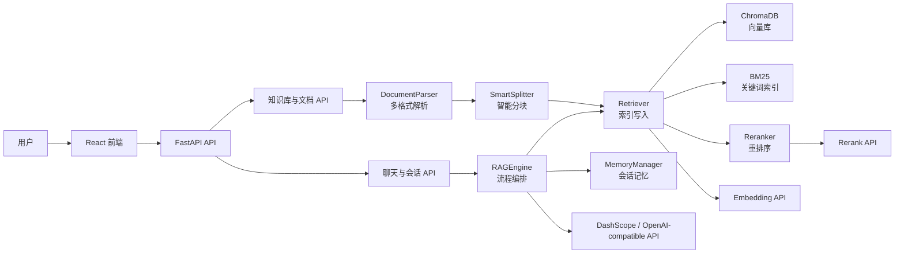

# KBzhy RAG Studio Lab

> 基于 FastAPI、React、ChromaDB 与阿里云百炼兼容 OpenAI API 的企业级 RAG 知识库问答系统。

KBzhy 是一个面向实训、原型验证和企业知识库场景的全栈 RAG 应用。项目提供完整的知识库管理、文档上传解析、智能分块、混合检索、重排序、多轮会话、流式问答和前端交互界面，适合用于学习 RAG 系统工程化落地，也可以作为内部知识库问答产品的基础骨架。

## 功能特性

- 知识库管理：支持创建、查看、删除多个知识库，并按知识库隔离向量数据。
- 多格式文档解析：支持 PDF、Word、Excel、PPT、TXT、Markdown、CSV 和图片 OCR。
- 智能文本分块：针对段落、表格、FAQ、条款、Excel 行数据等内容采用不同切分策略。
- 混合检索：结合 ChromaDB 向量检索、BM25 关键词检索、MMR 多样性选择提升召回质量。
- 多种重排序策略：支持模型 rerank、LLM 打分 rerank、关键词回退 rerank。
- 查询增强：支持查询扩展、复杂问题子问题拆解、多轮上下文查询改写。
- 严谨回答控制：内置知识库问答系统提示词，证据不足时拒答，减少无依据生成。
- 溯源与幻觉标记：回答返回来源片段，并对可能缺少证据支撑的句子做提示。
- 多轮会话：支持会话创建、会话列表、历史消息读取和自动标题生成。
- 流式输出：后端通过 SSE 返回增量内容、检索状态与来源信息。
- 前端控制台：React + Ant Design 实现知识库管理、文档上传、对话、参数调节等界面。

## 技术栈

### 后端

- Python 3.10+
- FastAPI
- Uvicorn
- Pydantic
- OpenAI Python SDK
- httpx
- LangChain Chroma
- ChromaDB
- rank-bm25
- jieba
- PyMuPDF / python-docx / openpyxl / python-pptx
- Redis，可选，用于会话热记忆与会话元数据缓存
- MySQL，可选，当前配置预留

### 前端

- React 18
- Vite 5
- Ant Design 5
- React Router
- React Markdown
- remark-gfm / remark-breaks

### 模型与平台

默认面向阿里云百炼 DashScope 兼容 OpenAI API：

- LLM：`qwen3.6-flash`
- Embedding：`text-embedding-v4`
- Reranker：`qwen3-vl-rerank`

模型名称和 API Base 均可通过环境变量调整。

## 系统架构



## 目录结构

```text
KBzhy/
├── app/
│   ├── api/
│   │   ├── chat.py              # 会话、单轮问答、多轮问答、流式问答 API
│   │   └── documents.py         # 知识库与文档管理 API
│   ├── core/
│   │   ├── engine.py            # RAGEngine 单例入口
│   │   ├── memory.py            # 会话记忆管理
│   │   ├── parser.py            # 多格式文档解析
│   │   ├── rag_engine.py        # RAG 主流程编排
│   │   ├── retriever.py         # 混合检索、MMR、rerank、查询增强
│   │   ├── splitter.py          # 智能文本分块
│   │   └── timing.py            # 性能阶段日志
│   └── models/
│       └── schemas.py           # Pydantic 请求和响应模型
├── frontend/
│   ├── src/
│   │   ├── api/                 # 前端 API 封装
│   │   ├── components/          # 对话、上传、表格、配置面板等组件
│   │   └── pages/               # ChatPage 与 DocumentsPage
│   ├── vite.config.js           # Vite 配置与 /api 代理
│   └── serve-proxy.cjs          # 生产静态文件代理服务
├── tests/                       # 后端与前端静态测试
├── config.py                    # 全局配置
├── main.py                      # FastAPI 入口
├── requirements.txt             # Python 依赖
├── .env.example                 # 环境变量示例
└── LICENSE
```

## 快速开始

### 1. 克隆项目

```bash
git clone <your-repo-url>
cd RAG-Studio-Lab
```

本项目作为 Python 包 `KBzhy` 运行，推荐在其父目录 `RAG-Studio-Lab` 下启动后端。

### 2. 配置后端环境

```bash
cd KBzhy
python -m venv .venv
```

Windows PowerShell：

```powershell
.\.venv\Scripts\Activate.ps1
pip install -r requirements.txt
```

macOS / Linux：

```bash
source .venv/bin/activate
pip install -r requirements.txt
```

复制环境变量模板：

```bash
cp .env.example .env
```

Windows PowerShell：

```powershell
Copy-Item .env.example .env
```

然后编辑 `.env`，至少配置：

```env
DASHSCOPE_API_KEY=sk-your-dashscope-api-key
DASHSCOPE_API_BASE=https://dashscope.aliyuncs.com/compatible-mode/v1
LLM_MODEL=qwen3.6-flash
EMBEDDING_MODEL=text-embedding-v4
RERANKER_MODEL=qwen3-vl-rerank
```

### 3. 启动后端

在 `RAG-Studio-Lab` 目录执行：

```bash
uvicorn KBzhy.main:app --reload --host 0.0.0.0 --port 8000
```

也可以在 `KBzhy` 目录执行：

```bash
python main.py
```

访问：

- Swagger API 文档：http://localhost:8000/docs
- 健康检查：http://localhost:8000/api/health

### 4. 启动前端

新开一个终端：

```bash
cd KBzhy/frontend
npm install
npm run dev
```

访问：

- 前端控制台：http://localhost:3000

Vite 已配置 `/api` 代理到 `http://127.0.0.1:8000`，开发时前端无需额外配置后端地址。

## 使用流程

1. 打开前端控制台。
2. 进入“文档管理”页面，新建知识库。
3. 进入知识库详情，上传文档。
4. 等待文档解析、分块、向量化完成。
5. 进入对话页面，新建会话并绑定知识库。
6. 输入问题，系统会检索相关片段并基于知识库生成回答。
7. 在回答下方查看来源片段、页码、相似度和可能的幻觉提示。

## 环境变量

| 变量 | 默认值 | 说明 |
| --- | --- | --- |
| `DASHSCOPE_API_KEY` | `your-api-key` | 阿里云百炼 API Key，必填 |
| `DASHSCOPE_API_BASE` | `https://dashscope.aliyuncs.com/compatible-mode/v1` | 兼容 OpenAI API Base |
| `LLM_MODEL` | `qwen3.6-flash` | 问答、查询改写、摘要等 LLM 模型 |
| `EMBEDDING_MODEL` | `text-embedding-v4` | 向量化模型 |
| `RERANKER_MODEL` | `qwen3-vl-rerank` | 专用重排序模型 |
| `TEMPERATURE` | `0.5` | 默认生成温度 |
| `RERANK_METHOD` | `model` | 默认重排序策略：`model` / `llm` / `keyword` |
| `REDIS_HOST` | `localhost` | Redis 主机 |
| `REDIS_PORT` | `6379` | Redis 端口 |
| `REDIS_DB` | `0` | Redis 数据库编号 |
| `REDIS_PASSWORD` | 空 | Redis 密码 |
| `REDIS_TTL` | `1800` | Redis 会话过期时间 |
| `MYSQL_HOST` | `localhost` | MySQL 主机，当前为预留配置 |
| `MYSQL_PORT` | `3306` | MySQL 端口 |
| `MYSQL_USER` | `root` | MySQL 用户 |
| `MYSQL_PASSWORD` | 空 | MySQL 密码 |
| `MYSQL_DATABASE` | `kbzhy` | MySQL 数据库名 |

## 核心 API

### 健康检查

```http
GET /api/health
```

### 知识库

```http
POST   /api/knowledge-bases
GET    /api/knowledge-bases
DELETE /api/knowledge-bases/{kb_id}
```

### 文档

```http
POST   /api/knowledge-bases/{kb_id}/documents/upload
GET    /api/knowledge-bases/{kb_id}/documents
GET    /api/knowledge-bases/{kb_id}/documents/{doc_id}/chunks
PUT    /api/knowledge-bases/{kb_id}/documents/{doc_id}
DELETE /api/knowledge-bases/{kb_id}/documents/{doc_id}
```

### 会话

```http
POST   /api/sessions
GET    /api/sessions
GET    /api/sessions/{session_id}/messages
DELETE /api/sessions/{session_id}
```

### 问答

```http
POST /api/chat
POST /api/chat/stream
POST /api/chat/{session_id}
POST /api/chat/{session_id}/stream
```

请求示例：

```json
{
  "question": "这份制度里请假的审批流程是什么？",
  "kb_id": "your_kb_id",
  "top_k": 5,
  "chain_type": "stuff",
  "temperature": 0.5,
  "rerank_method": "model",
  "similarity_threshold": 0.35,
  "enable_expansion": false,
  "enable_rewrite": false
}
```

响应示例：

```json
{
  "answer": "根据知识库资料，...",
  "session_id": "abc123",
  "sources": [
    {
      "content": "相关文档片段",
      "source": "员工手册.pdf",
      "page": 3,
      "score": 0.82
    }
  ],
  "hallucination_flags": []
}
```

## RAG 流程

1. 文档解析：按文件类型提取文本、表格、页码、Sheet、幻灯片等元数据。
2. 智能分块：按文档结构选择段落、行、FAQ、条款或递归字符切分。
3. 索引写入：将分块写入 ChromaDB，并同步构建 BM25 内存索引。
4. 查询准备：多轮场景下按需改写问题，复杂问题可拆解为子问题。
5. 混合召回：向量相似度和 BM25 关键词召回加权融合。
6. MMR 筛选：在相关性和多样性之间平衡，降低重复片段。
7. Rerank 重排：优先使用模型 rerank，失败后自动回退关键词评分。
8. 生成回答：根据 `stuff`、`map_reduce` 或 `refine` 策略组织上下文。
9. 溯源与检查：返回来源片段，并用关键词覆盖率做轻量幻觉提示。

## 前端说明

前端包含两个主要工作区：

- 文档管理：创建知识库、查看知识库状态、上传文档、查看文档列表和分块。
- 知识库问答：创建会话、选择知识库、配置检索参数、流式提问、展示来源。

可调参数包括：

- `top_k`：返回的候选片段数。
- `temperature`：生成温度。
- `chain_type`：回答链路，支持 `stuff`、`map_reduce`、`refine`。
- `rerank_method`：重排序方式，支持 `model`、`llm`、`keyword`。
- `similarity_threshold`：相似度阈值，低于阈值会触发拒答。
- `enable_expansion`：是否启用查询扩展。
- `enable_rewrite`：是否强制启用多轮查询改写。

## 测试

后端测试使用 pytest：

```bash
pytest
```

测试覆盖方向包括：

- Pydantic Schema 校验
- 文档 API
- 流式聊天协议
- RAG Engine 行为
- Retriever 检索逻辑
- Splitter 分块策略
- 前端静态构建约束
- 性能阶段日志工具

前端构建校验：

```bash
cd frontend
npm run build
```

## 构建与部署

### 前端构建

```bash
cd frontend
npm run build
```

### 静态前端代理运行

项目提供了一个简单的 Node 静态服务与 API 代理：

```bash
cd frontend
node serve-proxy.cjs
```

访问：

```text
http://localhost:3000
```

该服务会托管 `frontend/dist`，并将 `/api/*` 转发到 `http://127.0.0.1:8000`。

### 后端生产建议

生产环境建议使用进程管理器或容器运行 FastAPI，例如：

```bash
uvicorn KBzhy.main:app --host 0.0.0.0 --port 8000
```

如需更高并发，可结合 Gunicorn/Uvicorn Worker、Nginx 反向代理、Redis 独立部署和持久化卷管理 ChromaDB 数据。

## 数据与持久化

默认本地持久化路径：

- `chroma_db/`：ChromaDB 向量数据库。
- `data/doc_registry.json`：文档注册表。
- `data/kb_meta.json`：知识库元数据。
- `data/conversations/`：会话相关本地数据目录。

这些运行时数据默认不建议提交到 Git。`.gitignore` 已排除相关目录和文件。

## 安全注意事项

- 不要将 `.env`、API Key、Token、密码提交到仓库。
- 当前 CORS 配置允许所有来源，生产环境应收敛到可信域名。
- 上传文件大小限制默认为 50 MB，可在 `config.py` 中调整。
- 文档内容会发送给模型服务进行 embedding、rerank、OCR 或回答生成，接入真实企业数据前应确认合规要求。
- `serve-proxy.cjs` 已做基础目录穿越防护，但生产静态资源服务建议使用 Nginx 或专用网关。

## 适用场景

- RAG 课程实训与项目展示。
- 企业内部文档问答原型。
- 多格式知识库检索实验。
- RAG 检索策略、分块策略、rerank 策略对比。
- FastAPI + React 全栈 AI 应用工程化样板。

## 许可证

本项目使用 Apache License 2.0，详见 [LICENSE](./LICENSE)。
