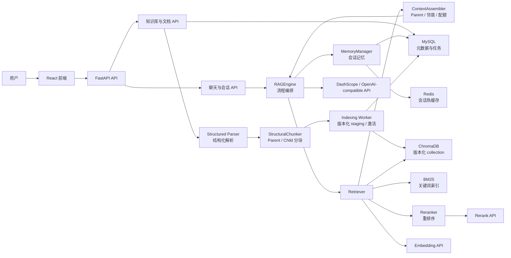

# KBzhy RAG Studio Lab

[](https://www.python.org/)
[](https://fastapi.tiangolo.com/)
[](https://react.dev/)
[](https://vitejs.dev/)
[](https://www.trychroma.com/)
[](https://www.mysql.com/)
[](https://redis.io/)
[](#rag-流程)
[](LICENSE)

> 面向 RAG 实训、原型验证与企业知识库场景的全栈智能问答系统：**FastAPI API + React 控制台 + ChromaDB 混合检索 + MySQL 持久化 + Redis 会话热缓存**。

KBzhy 是一个面向实训、原型验证和企业知识库场景的全栈 RAG 应用。项目提供完整的知识库管理、文档上传解析、智能分块、混合检索、重排序、多轮会话、流式问答和前端交互界面，适合用于学习 RAG 系统工程化落地，也可以作为内部知识库问答产品的基础骨架。

## 功能特性

- 知识库管理：支持创建、查看、删除多个知识库，并按知识库隔离向量数据。
- 多格式文档解析：PDF、Word、Markdown、TXT 采用结构化解析；Excel、PPT、CSV 和图片 OCR 保留兼容解析链路。
- 父子分块：按章节与元素边界生成 Parent/Child，检索 Child、组装 Parent 上下文，保留页码和结构路径。
- 混合检索：并发执行 ChromaDB 向量召回与 BM25 关键词召回，用 RRF 按 `chunk_id` 去重融合。
- 宽召回重排序：默认从融合候选中取 Top 30 做模型 rerank，失败时回退关键词评分，并使用独立阈值过滤。
- 安全索引切换：文档版本先写 staging，成功后原子激活；知识库重索引先构建临时 collection，全部成功后再切换指针。
- 查询增强：支持查询扩展、复杂问题子问题拆解、多轮上下文查询改写。
- 严谨回答控制：内置知识库问答系统提示词，证据不足时拒答，减少无依据生成。
- 溯源与幻觉标记：回答返回来源片段，并对可能缺少证据支撑的句子做提示。
- 多轮会话：支持会话创建、会话列表、历史消息读取和自动标题生成。
- 流式输出：后端通过 SSE 返回增量内容、检索状态与来源信息。
- 前端控制台：React + Ant Design 实现知识库管理、文档上传、对话、参数调节等界面。

## 技术栈

| 分层 | 技术 | 职责 |
| --- | --- | --- |
| 前端 | React 18、Vite 5、Ant Design 5 | 知识库管理、文档上传、流式问答与检索参数配置 |
| API | Python 3.10+、FastAPI、Uvicorn、Pydantic | REST/SSE 接口、请求校验与 RAG 流程编排 |
| 模型接入 | OpenAI Python SDK、httpx | 调用兼容 OpenAI 协议的 LLM、Embedding 与 Rerank 服务 |
| 检索 | LangChain Chroma、ChromaDB、rank-bm25、jieba | 向量/BM25 并发召回、RRF 融合、宽候选重排与父级上下文组装 |
| 文档解析 | PyMuPDF、python-docx、openpyxl、python-pptx | PDF、Word、Excel、PPT 等多格式内容解析 |
| 持久化 | MySQL | 存储知识库、文档、索引任务元数据及完整对话记录 |
| 热缓存 | Redis（可选） | 缓存最近会话上下文和会话元数据；不可用时回退本地文件 |

### 默认模型与平台

默认面向阿里云百炼 DashScope 兼容 OpenAI API：

- LLM：`qwen3.6-flash`
- Embedding：`text-embedding-v4`
- Reranker：`qwen3-vl-rerank`

模型名称和 API Base 均可通过环境变量调整。

## 系统架构


```mermaid
flowchart LR
    User["用户"] --> UI["React 前端"]
    UI --> API["FastAPI API"]

    API --> KB["知识库与文档 API"]
    API --> Chat["聊天与会话 API"]

    KB --> Parser["Structured Parser<br/>结构化解析"]
    Parser --> Splitter["StructuralChunker<br/>Parent / Child 分块"]
    Splitter --> Indexer["Indexing Worker<br/>版本化 staging / 激活"]

    Chat --> Engine["RAGEngine<br/>流程编排"]
    Engine --> Retriever
    Retriever --> Context["ContextAssembler<br/>Parent / 邻居 / 配额"]
    Context --> Engine
    Engine --> Memory["MemoryManager<br/>会话记忆"]
    KB --> MySQL["MySQL<br/>元数据与任务"]
    Memory --> Redis["Redis<br/>会话热缓存"]
    Memory --> MySQL

    Indexer --> MySQL
    Indexer --> Chroma["ChromaDB<br/>版本化 collection"]
    Retriever --> Chroma
    Retriever --> BM25["BM25<br/>关键词索引"]
    Retriever --> Rerank["Reranker<br/>重排序"]

    Engine --> LLM["DashScope / OpenAI-compatible API"]
    Retriever --> Embedding["Embedding API"]
    Rerank --> RerankAPI["Rerank API"]
```

## 目录结构

```text
KBzhy/
├── app/
│   ├── api/
│   │   ├── chat.py              # 会话、单轮问答、多轮问答、流式问答 API
│   │   └── documents.py         # 知识库与文档管理 API
│   ├── core/
│   │   ├── engine.py            # RAGEngine 单例入口
│   │   ├── memory.py            # 会话记忆管理
│   │   ├── document_models.py   # 文档、元素与 Parent/Child 数据模型
│   │   ├── parser.py            # 结构化解析入口与解析产物存取
│   │   ├── parsers/             # PDF、Word、Markdown、TXT 专用解析器
│   │   ├── rag_engine.py        # RAG 主流程编排
│   │   ├── retriever.py         # 向量/BM25 召回、RRF 融合与 rerank
│   │   ├── splitter.py          # 结构化 Parent/Child 分块
│   │   ├── chunk_repository.py  # 分块 staging、版本激活与上下文族读取
│   │   ├── context_assembler.py # Parent、邻居、文档配额与 token 预算
│   │   ├── indexing_worker.py   # 异步索引与故障恢复
│   │   ├── metadata_store.py    # MySQL 元数据、版本与任务事务
│   │   ├── reindex_service.py   # 知识库安全重索引服务与 CLI
│   │   ├── token_counter.py     # 统一 token 计数
│   │   └── timing.py            # 性能阶段日志
│   └── models/
│       └── schemas.py           # Pydantic 请求和响应模型
├── frontend/
│   ├── src/
│   │   ├── api/                 # 前端 API 封装
│   │   ├── components/          # 对话、上传、表格、配置面板等组件
│   │   └── pages/               # ChatPage 与 DocumentsPage
│   ├── vite.config.js           # Vite 配置与 /api 代理
│   └── serve-proxy.cjs          # 生产静态文件代理服务
├── tests/                       # 后端与前端静态测试
├── config.py                    # 全局配置
├── main.py                      # FastAPI 入口
├── requirements.txt             # Python 依赖
├── .env.example                 # 环境变量示例
└── LICENSE
```

## 快速开始

### 1. 克隆项目

```bash
git clone <your-repo-url>
cd RAG-Studio-Lab
```

本项目作为 Python 包 `KBzhy` 运行，推荐在其父目录 `RAG-Studio-Lab` 下启动后端。

### 2. 配置后端环境

```bash
cd KBzhy
python -m venv .venv
```

Windows PowerShell：

```powershell
.\.venv\Scripts\Activate.ps1
pip install -r requirements.txt
```

macOS / Linux：

```bash
source .venv/bin/activate
pip install -r requirements.txt
```

复制环境变量模板：

```bash
cp .env.example .env
```

Windows PowerShell：

```powershell
Copy-Item .env.example .env
```

然后编辑 `.env`，至少配置：

```env
DASHSCOPE_API_KEY=sk-your-dashscope-api-key
DASHSCOPE_API_BASE=https://dashscope.aliyuncs.com/compatible-mode/v1
LLM_MODEL=qwen3.6-flash
EMBEDDING_MODEL=text-embedding-v4
RERANKER_MODEL=qwen3-vl-rerank
```

### 3. 启动后端

在 `RAG-Studio-Lab` 目录执行：

```bash
uvicorn KBzhy.main:app --reload --host 0.0.0.0 --port 8000
```

也可以在 `KBzhy` 目录执行：

```bash
python main.py
```

访问：

- Swagger API 文档：http://localhost:8000/docs
- 健康检查：http://localhost:8000/api/health

### 4. 启动前端

新开一个终端：

```bash
cd KBzhy/frontend
npm install
npm run dev
```

访问：

- 前端控制台：http://localhost:3000

Vite 已配置 `/api` 代理到 `http://127.0.0.1:8000`，开发时前端无需额外配置后端地址。

## 使用流程

1. 打开前端控制台。
2. 进入“文档管理”页面，新建知识库。
3. 进入知识库详情，上传文档。
4. 等待文档解析、分块、向量化完成。
5. 进入对话页面，新建会话并绑定知识库。
6. 输入问题，系统会检索相关片段并基于知识库生成回答。
7. 在回答下方查看来源片段、页码、相似度和可能的幻觉提示。

## 环境变量

| 变量 | 默认值 | 说明 |
| --- | --- | --- |
| `DASHSCOPE_API_KEY` | `your-api-key` | 阿里云百炼 API Key，必填 |
| `DASHSCOPE_API_BASE` | `https://dashscope.aliyuncs.com/compatible-mode/v1` | 兼容 OpenAI API Base |
| `LLM_MODEL` | `qwen3.6-flash` | 问答、查询改写、摘要等 LLM 模型 |
| `EMBEDDING_MODEL` | `text-embedding-v4` | 向量化模型 |
| `RERANKER_MODEL` | `qwen3-vl-rerank` | 专用重排序模型 |
| `TEMPERATURE` | `0.5` | 默认生成温度 |
| `RERANK_METHOD` | `model` | 默认重排序策略：`model` / `llm` / `keyword` |
| `TOKEN_ENCODING` | `cl100k_base` | 分块与上下文预算使用的 token 编码 |
| `VECTOR_FETCH_K` | `30` | 向量召回候选数 |
| `BM25_FETCH_K` | `30` | BM25 召回候选数 |
| `RRF_K` | `60` | RRF 排名平滑常数 |
| `RRF_CANDIDATE_K` | `40` | RRF 融合后保留的候选数 |
| `RERANK_CANDIDATE_K` | `30` | 送入重排序的宽候选数 |
| `MODEL_RERANK_THRESHOLD` | `0.35` | 模型重排序最低分；默认与相似度阈值一致 |
| `KEYWORD_RERANK_THRESHOLD` | `0` | 关键词回退重排序最低分 |
| `CONTEXT_PER_DOCUMENT_LIMIT` | `3` | 单文档最多进入上下文的候选族数量 |
| `CONTEXT_NEIGHBOR_WINDOW` | `1` | 命中 Child 两侧加载的邻居数量 |
| `CONTEXT_SINGLE_SOURCE_TOKEN_BUDGET` | `2000` | 单来源可占用的最大 token 预算 |
| `REDIS_HOST` | `localhost` | Redis 主机 |
| `REDIS_PORT` | `6379` | Redis 端口 |
| `REDIS_DB` | `0` | Redis 数据库编号 |
| `REDIS_PASSWORD` | 空 | Redis 密码 |
| `REDIS_TTL` | `86400` | Redis 会话过期时间 |
| `MYSQL_HOST` | `localhost` | MySQL 主机；知识库与文档管理依赖该数据库 |
| `MYSQL_PORT` | `3306` | MySQL 端口 |
| `MYSQL_USER` | `root` | MySQL 用户 |
| `MYSQL_PASSWORD` | 空 | MySQL 密码 |
| `MYSQL_DATABASE` | `kbzhy` | MySQL 数据库名 |

## 核心 API

### 健康检查

```http
GET /api/health
```

### 知识库

```http
POST   /api/knowledge-bases
GET    /api/knowledge-bases
DELETE /api/knowledge-bases/{kb_id}
```

### 文档

```http
POST   /api/knowledge-bases/{kb_id}/documents/upload
GET    /api/knowledge-bases/{kb_id}/documents
GET    /api/knowledge-bases/{kb_id}/documents/{doc_id}/chunks
PUT    /api/knowledge-bases/{kb_id}/documents/{doc_id}
DELETE /api/knowledge-bases/{kb_id}/documents/{doc_id}
```

### 会话

```http
POST   /api/sessions
GET    /api/sessions
GET    /api/sessions/{session_id}/messages
DELETE /api/sessions/{session_id}
```

### 问答

```http
POST /api/chat
POST /api/chat/stream
POST /api/chat/{session_id}
POST /api/chat/{session_id}/stream
```

请求示例：

```json
{
  "question": "这份制度里请假的审批流程是什么？",
  "kb_id": "your_kb_id",
  "top_k": 5,
  "chain_type": "stuff",
  "temperature": 0.5,
  "rerank_method": "model",
  "similarity_threshold": 0.35,
  "enable_expansion": false,
  "enable_rewrite": false
}
```

响应示例：

```json
{
  "answer": "根据知识库资料，...",
  "session_id": "abc123",
  "sources": [
    {
      "content": "相关文档片段",
      "source": "员工手册.pdf",
      "page": 3,
      "score": 0.82
    }
  ],
  "hallucination_flags": []
}
```

## RAG 流程

1. 结构化解析：PDF、Word、Markdown、TXT 输出统一 Element，并保存可复用的解析产物；其余格式走兼容适配器。
2. 父子分块：按章节生成 Parent，按元素语义边界生成 Child；超长元素才做 token 安全硬切。
3. 版本化索引：新版本先进入 staging，向量与 MySQL 分块均成功后再原子切换 active 版本。
4. 查询准备：多轮场景下按需改写问题，复杂问题可拆解为子问题。
5. 混合召回：在当前 active collection 上并发执行向量与 BM25 召回，只接收 active 文档版本。
6. RRF 融合：按排名融合并用稳定的 `chunk_id` 去重，避免不同评分尺度直接相加。
7. 宽候选重排：对融合后的 Top 30 优先使用模型 rerank，调用失败时回退关键词评分。
8. 上下文组装：围绕命中 Child 读取 Parent 和相邻 Child，执行文档配额、去重与 token 预算控制。
9. 生成回答：根据 `stuff`、`map_reduce` 或 `refine` 策略使用组装后的证据上下文回答。
10. 溯源与检查：来源仍对应原始检索候选；阈值和系统提示词负责证据不足拒答，关键词覆盖率提供轻量幻觉提示。

### 重复上传与版本语义

- 同一知识库上传相同内容时返回 `409`，不会重复构建索引。
- 更新文档但内容哈希未变化时按幂等成功处理，不创建新版本。
- 相同文件可以上传到不同知识库，各知识库独立维护文档、版本和 collection。
- 文档任务依次经过 `queued → parsing → chunking → indexing → ready`；失败任务保留明确状态与错误信息。

### 安全重索引

重索引当前只提供运维 CLI，不开放 HTTP 接口：

```bash
python -m KBzhy.app.core.reindex_service --kb-id <knowledge-base-id>
```

服务会为知识库创建临时 collection，并对所有 ready 文档重建索引。只有全部文档成功，才会在 MySQL 事务中切换知识库的 active collection 指针；任一文档失败都会保留旧 collection 继续服务。验证新索引后，可由运维代码显式调用 `ReindexService.cleanup_collection(kb_id, collection_name)` 清理旧 collection；该方法会拒绝删除当前 active collection。

### 故障恢复边界

- 解析、分块或索引明确失败时，会清理本次 staging 向量和安全目录，旧 active 版本不受影响。
- 进程重启后，恢复器先原子确认任务仍可恢复，再清理本次未完成向量并重新排队，避免误删已激活版本。
- 如果提交结果因数据库连接异常而无法确认，系统不会删除向量或文件，也不会强行写失败状态，留待后续权威查询与恢复。
- MySQL 与 ChromaDB 仍是双写边界，不是分布式事务；上线时应为失败任务、staging 数量和临时 collection 建立监控。

## 前端说明

前端包含两个主要工作区：

- 文档管理：创建知识库、查看知识库状态、上传文档、查看文档列表和分块。
- 知识库问答：创建会话、选择知识库、配置检索参数、流式提问、展示来源。

可调参数包括：

- `top_k`：返回的候选片段数。
- `temperature`：生成温度。
- `chain_type`：回答链路，支持 `stuff`、`map_reduce`、`refine`。
- `rerank_method`：重排序方式，支持 `model`、`llm`、`keyword`。
- `similarity_threshold`：相似度阈值，低于阈值会触发拒答。
- `enable_expansion`：是否启用查询扩展。
- `enable_rewrite`：是否强制启用多轮查询改写。

## 测试

后端测试使用 pytest：

```bash
pytest
```

测试覆盖方向包括：

- Pydantic Schema 校验
- 文档 API
- 流式聊天协议
- RAG Engine 行为
- Retriever 并发召回、RRF 与宽候选重排
- 结构化解析、Parent/Child 分块与上下文组装
- 文档版本、索引任务、恢复竞态与安全重索引
- 前端静态构建约束
- 性能阶段日志工具

前端构建校验：

```bash
cd frontend
npm run build
```

## 构建与部署

### 前端构建

```bash
cd frontend
npm run build
```

### 静态前端代理运行

项目提供了一个简单的 Node 静态服务与 API 代理：

```bash
cd frontend
node serve-proxy.cjs
```

访问：

```text
http://localhost:3000
```

该服务会托管 `frontend/dist`，并将 `/api/*` 转发到 `http://127.0.0.1:8000`。

### 后端生产建议

生产环境建议使用进程管理器或容器运行 FastAPI，例如：

```bash
uvicorn KBzhy.main:app --host 0.0.0.0 --port 8000
```

如需更高并发，可结合 Gunicorn/Uvicorn Worker、Nginx 反向代理、Redis 独立部署和持久化卷管理 ChromaDB 数据。

## 数据与持久化

项目按数据用途采用分层存储：

| 存储 | 数据内容 | 是否必需 | 持久化说明 |
| --- | --- | --- | --- |
| ChromaDB | 文档分块、向量及分块元数据 | 是 | 默认写入项目根目录下的 `chroma_db/` |
| MySQL | 知识库、文档、文档版本、Parent/Child 分块、索引任务及完整对话记录 | 是 | 核心表包括 `knowledge_bases`、`documents`、`document_versions`、`document_chunks`、`document_index_tasks`、`conversation_logs`；知识库和文档接口在数据库异常时返回稳定的 `500` 文案，并在服务端记录原始错误 |
| Redis | 最近 N 轮会话上下文及会话元数据 | 否 | 热缓存数据按 TTL 过期；不可用时会话数据回退到本地文件 |
| 本地文件 | Redis 或 MySQL 不可用时的会话上下文与对话日志 | 回退存储 | 默认写入 `data/conversations/` |

`data/doc_registry.json` 和 `data/kb_meta.json` 仅用于兼容并迁移旧版本元数据，不再是当前主存储。ChromaDB 与本地回退文件均属于运行时数据，默认不建议提交到 Git；MySQL 和 Redis 的生产环境数据应通过独立实例及备份策略管理。

## 安全注意事项

- 不要将 `.env`、API Key、Token、密码提交到仓库。
- 当前 CORS 配置允许所有来源，生产环境应收敛到可信域名。
- 上传文件大小限制默认为 50 MB，可在 `config.py` 中调整。
- 文档内容会发送给模型服务进行 embedding、rerank、OCR 或回答生成，接入真实企业数据前应确认合规要求。
- `serve-proxy.cjs` 已做基础目录穿越防护，但生产静态资源服务建议使用 Nginx 或专用网关。

## 适用场景

- RAG 课程实训与项目展示。
- 企业内部文档问答原型。
- 多格式知识库检索实验。
- RAG 检索策略、分块策略、rerank 策略对比。
- FastAPI + React 全栈 AI 应用工程化样板。

## 许可证

本项目使用 Apache License 2.0，详见 [LICENSE](./LICENSE)。
